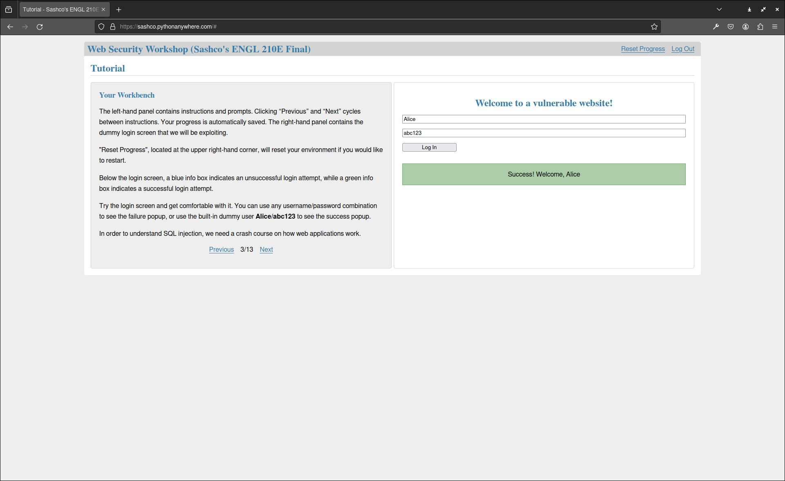
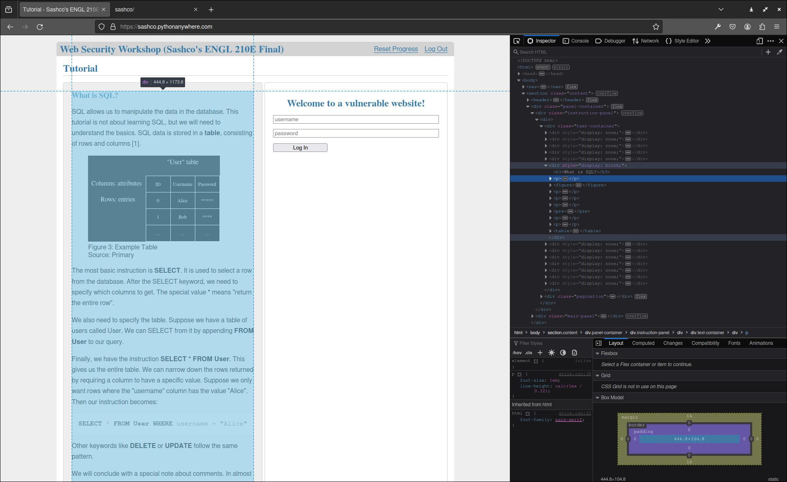

I took a technical writing course (ENGL 210E) this term. For the final project, I made a hands-on tutorial on the basics of web vulnerabilities. I've put together some of the interesting problems I faced during development of this [Web Security Workshop](https://sashco.pythonanywhere.com).

<!--more-->

# Idea
I wanted the audience to learn web security best practices from this tutorial. Most people learn best by doing, so I decided to centre the workshop around an insecure login screen that allows you to experiment with the exploits in a simulated environment. After a few days of development, this is what I came up with:



# Tools
My go-to for a simple web application is [Flask](https://flask.palletsprojects.com/en/3.0.x/). Hosting is fast and easy (and free!) with [pythonanywhere](https://www.pythonanywhere.com/). I can set up a [virtual environment](https://help.pythonanywhere.com/pages/Virtualenvs/) on the server so I don't run into any surprise dependency errors when moving off of my local machine. You can even set up a [MySQL](https://help.pythonanywhere.com/pages/UsingMySQL/) instance for free, but SQLite was better for my usecase.

# Problem 1: How do you secure an insecure database? 
The biggest problem is that we need to expose an insecure database to the user. To solve this, I created a system of Access Tokens. There is a (secure) access token database, and isolated user databases that get created for each token. Since I used SQLite, creating a new database is as easy as creating a new file. So, each user can do whatever they want to their own database instance. New access tokens can be added via a script. The code is quite simple:

```Python
def get_user_db(token):
    if 'user_db' not in g:
        g.user_db = sqlite3.connect(
            os.path.join(current_app.instance_path, token +'_user.db'),
            detect_types=sqlite3.PARSE_DECLTYPES
        )
        g.user_db.row_factory = sqlite3.Row

    return g.user_db

...

def init_user_db(token):
    db = get_user_db(token)

    with current_app.open_resource('user_schema.sql') as f:
        db.executescript(f.read().decode('utf8'))

    # dummy user
    db.execute(f'insert into users (username, password) values ("Alice", "abc123")')

    db.commit()
```

# Improvements:
There are some drawbacks to this approach. One obvious disadvantage is that I have to give an access token to each user. This is fine when my only expected users are myself and my professor, but it would have been nicer to be able to share it publically. I could solve this by replacing access tokens with some identitifier that gets saved in a cookie when a user first accesses the site. On the backend, we can create a new database for that identifier and keep track of the last time they made a request. Finally, a cron could run hourly that deletes the databases that haven't been used recently.

I like how user-friendly and simple this is. However, a single script that repeatedly throws away cookies and pings the site might be able to bring the server to a halt with all the file creation.

# Problem 2: How to progress through the tutorial?
Another problem is about how the user should progress through the tutorial. Originally, I had the progression tied to each login attempt. If they did the SQL injection correctly it would move them on to the next section. I realized this was not flexible enough for what I wanted to do. Instead, I decoupled the two completely. Now, a user can flip through the instructions however the like and experiment with injections to their hearts content.

A sub-problem then is how to know which section of the tutorial to show to the user. The simplest way was to keep all the instructions in one html file. These instructions are passed to a pagination template, where a simple script runs that hides everything except the "current" page. We can see it in action here:



The benefit is that it's very fast to move between instructions since all the pagination is client-side. The downside is that the initial load might take a little longer. I think this is well worth it though, since this load only happens once. Calling the server for each new instruction page would be much more annoying.

Finally, even that large html file is only ~350 lines. The lack of abstraction also makes it much more flexible, and allowed me to add images and other specific html elements very easily. No need to over-engineer it!

# Improvements:
When the Previous/Next buttons are clicked, the current page is also sent back to the server where it's saved on the token. This allows you to log out and later resume exactly where you left off. However, this entire workshop is short and only takes around 15-20 minutes to complete. This functionality is cool, but unnecessary and could be removed for the sake of simplicity.

# Conclusion
I'm glad that this final project was open-ended, so I could work on something I was really passionate about. The challenges were fun and a refreshing change from all the exam studying I was doing. It also helped solidify my understanding of web security. On to the next!
